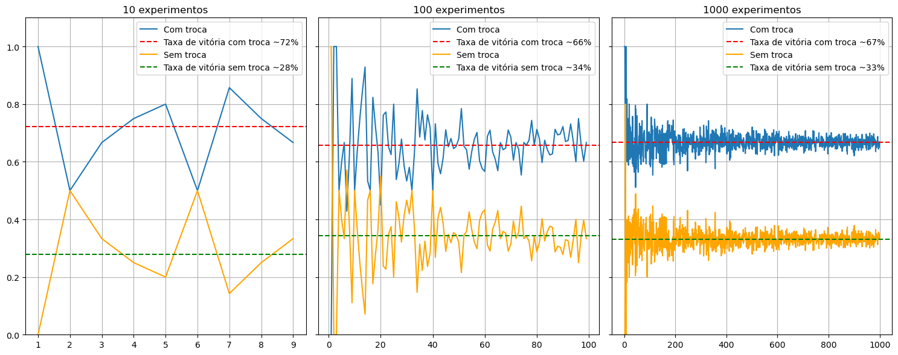

# Trocar ou não trocar, eis a porta do milhão.

Recentemente, durante minhas aventuras pelo curso [Probest - ICMC, USP](https://www.linkedin.com/school/icmc-usp/posts/?feedView=all), me deparei com o clássico problema de Monty-Hall de uma forma diferente.  
Por mais que seja um clássico problema de estatística, e que já foi vastamente explorado por incontáveis pessoas, esse problema, que eu só conhecia pelo filme [Quebrando a Banca](https://www.imdb.com/pt/title/tt0478087/), caiu pra mim como um exercício de Teorema de Bayes, mudando totalmente minha forma de pensar sobre como tudo pode funcionar diferente do pensamos.  
Eu sempre gostei de exatas, mas nunca tive a oportunidade de me aprofundar em problemas mais complexos igual estou tendo nessa fase da minha vida, e usar Bayes no Monty-Hall, e em outros exercícios, vem me mostrando como a matemática consegue traduzir o mundo em um punhado de símbolos.

$$
P(A_2 | X_3 \cap C_1) = 1 \text{  Chance de abrir a porta 2 dado que o prêmio está na 1 e eu escolhi a 3}
$$
$$
P(A_2 | X_3) = \frac{1}{2} \text{ Chance de abrir a porta 2 dado que escolhi a 3}
$$
$$
P(C_1) = \frac{1}{3} \text{ Chance do prêmio estar na porta 1}
$$
$$
P(X_3) = \frac{1}{3} \text{ Chance de eu escolher a porta 3}
$$

$$
P(C_1|A_2\cap X_3) = \frac{P(A_2 |X_3 \cap C_1)P(C_1)}{P(A_2
| X_3)}
$$

$$
P(C_1|A_2\cap X_3) = \frac{1 \times \frac{1}{3}}{\frac{1}{2}} = \frac{2}{3}
$$

O conceito foi bastante trabalhado no curso pelo professor [Francisco Rodrigues](https://sites.icmc.usp.br/francisco/), realizamos simulações em código e bastante cálculo manual pra tentar naturalizar o formato de encarar a realidade com matemática.  
Portanto, pensei em unir Monty-Hall com o método Monte Carlo, onde é realizado amostragens aleatórias e calculado a probabilidade com base nos resultados das amostras.

O experimento funciona da seguinte forma:  
1. É definido um número n de experimentos.
2. É definido 3 gráficos a serem preenchidos. Tais gráficos definem a quantidade de amostras
3. É rodado o primeiro processo de amostragem, nesse caso com 10 iterações.
4. Após o primeiro rodar, é multiplicado 10 ao número de experimentos.

*O algoritmo mede as chances de quando a porta é trocada e de quando não é.*

Ao final, temos 3 gráficos que demonstram como as chances se mantem maiores quando se troca a porta:

É nítido como as chances se afunilam conforme o número de experimentos aumenta. Inclusive, é justamente nisso que se sustenta a interpretação frequentista da probabilidade: 
$$
\lim_{n\to\infty}\frac{n_A}{n}
$$

Uma coisa interessante a se notar é o efeito espelho entre os experimentos.
Isso acontece pois a relação entre trocar ou não de porta é dada por:
$$
P(\text{Ganhar\_com\_troca}) = 1 - P(Ganhar\_sem\_troca)
$$  

Ou seja, ou você ganha com 1 - 0.33, ou ganha com 1 - 0.66. Por causa dessa relação, os valores se complementam.

No fim, caso você se depare com um caso de Monty-Hall por ai, troque de porta!